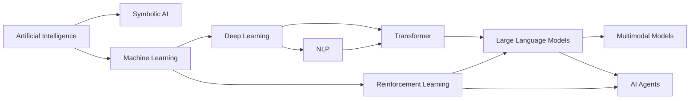

# 从人工智能到大模型：一条历史发展主线


## 为什么需要一条历史主线？

人工智能的发展并不是一条简单的技术替换路线，而是一系列问题不断被重新表述的过程。

早期 AI 关心的是：机器能不能像人一样推理、搜索和解决问题？  
机器学习兴起后，问题变成：机器能不能不依赖手写规则，而是从数据中学习规律？  
深度学习进一步推进了这个问题：机器能不能自动学习表示，而不是依赖人工设计特征？  
到了大语言模型时代，很多分散的方向开始汇合：语言理解、生成建模、表示学习、海量预训练、强化学习对齐、多模态交互和智能体系统。

因此，本页只做一件事：用一条粗略但清晰的发展脉络，把这些概念先串起来。

## 一张简化路线图



这张图不是完整年表，而是一张关系图：它强调的是概念之间的继承、分化和重新汇合。

## 1. Artificial Intelligence：总目标

人工智能最初关心的是一个很大的目标：

> 如何让机器表现出某种智能行为？

这里的“智能行为”可以包括推理、搜索、规划、对话、感知、决策、学习和创造。也就是说，AI 是一个总领域，不等同于某一种具体算法。

早期 AI 很自然地走向了符号主义路线：如果人类可以用规则、逻辑和符号表达知识，那么机器是否也可以通过规则系统进行推理？

这一路线产生了很多重要思想，例如搜索算法、逻辑推理、知识表示、规划系统和专家系统。它们擅长处理结构清晰、规则明确的问题，但也逐渐暴露出一个困难：现实世界太复杂，很多知识很难被完整地手写成规则。

## 2. Machine Learning：从手写规则到从数据中学习

机器学习的出现，代表了一次重要的方法转向。

如果规则难以穷尽地写出来，那就让机器从数据中学习规律。于是核心问题从“如何设计规则”转变为：

> 如何基于样本学习一个可以泛化到新数据的模型？

在这个阶段，监督学习、无监督学习、半监督学习、统计学习、概率模型、核方法、决策树、支持向量机等方法逐渐成为主线。它们共同推动了一个重要观念：模型不是只靠人类写死的规则工作，而是通过数据估计参数、学习模式。

这也解释了为什么机器学习和统计学、概率论、优化理论关系非常紧密。模型要从有限样本中学习，就必须面对不确定性、估计误差、泛化能力和训练目标。

## 3. Deep Learning：从人工特征到表示学习

传统机器学习常常依赖人工特征工程。比如在图像、语音、文本任务中，研究者需要先设计一套特征，再把这些特征交给模型。

深度学习真正改变的是表示学习方式：

> 模型不只是学习最后的分类器，也学习中间的表示。

多层神经网络可以把原始输入逐层变换成更抽象的 hidden representation。对于图像，这可能意味着从边缘、纹理到物体结构；对于语言，这可能意味着从 token、短语到语义关系；对于多模态任务，这可能意味着把文本、图像、音频映射到可以互相对齐的表示空间。

因此，深度学习不是简单地“神经网络变大了”，而是把模型能力推进到一个新的层次：让表示本身成为可学习的对象。

## 4. NLP：语言作为 AI 的核心入口

自然语言处理是 AI 中非常特殊的一条线，因为语言既是人类表达知识的方式，也是人与机器交互的主要接口。

早期 NLP 依赖规则和语言学知识，例如分词、词性标注、句法规则和模板系统。随后统计 NLP 兴起，语言问题开始更多地被建模为概率问题，例如语言模型、序列标注、机器翻译和信息检索。

神经网络 NLP 出现后，文本表示从离散符号逐渐转向向量表示。word2vec、RNN、Seq2Seq、Attention、Transformer 等方法不断推进语言建模能力。尤其是 Transformer 之后，预训练语言模型成为主线，NLP 不再只是某类具体任务，而逐渐成为通向大语言模型的核心路径。

可以粗略理解为：

```text
规则 NLP
→ 统计 NLP
→ 神经网络 NLP
→ 预训练语言模型
→ Large Language Models
```

## 5. Reinforcement Learning：学习如何行动

如果说监督学习主要回答“给定输入，应该输出什么”，那么强化学习更关心：

> 一个智能体应该如何在环境中连续行动，才能获得更好的长期结果？

强化学习的核心对象不是单次预测，而是序列决策。智能体需要观察状态、选择动作、获得奖励，并在长期反馈中改进策略。

这条线在游戏、机器人、控制、推荐系统和多智能体系统中非常重要。深度学习兴起后，Deep RL 把神经网络的表示能力和强化学习的决策框架结合起来，使复杂环境中的策略学习成为可能。

到了大模型时代，强化学习又以新的方式回到中心位置。RLHF 使用人类反馈来调整模型行为，Agent 系统则把大模型放入更长的任务链中，让模型不只是生成文本，也能规划、调用工具、观察结果并继续行动。

## 6. Transformer 与 LLM：现代 AI 的交汇点

Transformer 的重要性在于，它提供了一种非常适合大规模并行训练和长程依赖建模的架构。基于 Transformer 的预训练模型把语言建模推向了新的阶段：模型通过海量文本学习通用表示，再通过指令微调、对齐训练和工具使用扩展能力边界。

大语言模型因此成为多个方向的交汇点：

| 方向 | 在 LLM 中的体现 |
| --- | --- |
| Machine Learning | 从大规模数据中学习参数 |
| Deep Learning | 使用深层神经网络学习表示 |
| NLP | 以语言理解和生成作为核心任务 |
| Information Theory | 使用 cross entropy、next-token prediction 等训练目标 |
| Optimization | 通过大规模优化训练模型 |
| Reinforcement Learning | 通过 RLHF、偏好优化等方式对齐行为 |
| Multimodal AI | 将文本、图像、音频、视频等模态接入统一模型 |
| Agent | 让模型参与规划、工具调用和长程任务执行 |

所以，LLM 不是凭空出现的单点技术，而是长期发展中许多主线汇合后的结果。

## 7. 从关系看后续学习路径

后续学习时，可以先把这些领域放在一个层级关系中理解：

```text
Artificial Intelligence
→ Machine Learning
→ Deep Learning
→ Foundation Models / Large Language Models
```

同时，也要记住有些方向不是简单的上下级关系，而是任务领域或学习范式：

```text
NLP: 面向语言的任务领域
RL: 面向行动和决策的学习范式
Multimodal AI: 面向多种输入输出形式的建模方向
Agent: 面向任务执行和环境交互的系统形态
```

这样看，AI 知识体系就不再是一组孤立名词，而是一张逐渐展开的地图：

- AI 给出总目标：让机器表现出智能行为；
- ML 给出方法转向：从数据中学习，而不是完全手写规则；
- DL 提升模型能力：让表示本身可学习；
- NLP 让语言成为智能交互和知识建模的核心入口；
- RL 处理行动、反馈和长期决策；
- LLM 把语言建模、深度学习、大规模预训练和对齐方法汇合起来；
- Multimodal 和 Agent 则把大模型继续推向更丰富的感知、交互和任务执行。

这就是后续展开机器学习、深度学习、强化学习、自然语言处理和大语言模型内容时，可以反复回到的主线。
